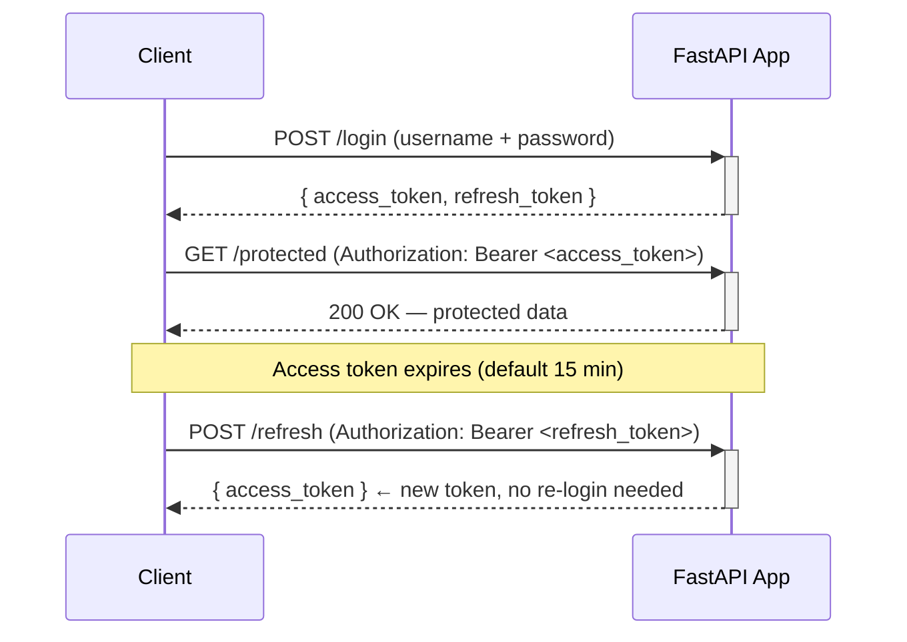

# 🔐 libre-fastapi-jwt

[](https://github.com/LibreNZ/libre-fastapi-jwt/actions/workflows/tests.yml)
[](https://github.com/LibreNZ/libre-fastapi-jwt/actions/workflows/codeql.yml)
[](https://badge.fury.io/py/libre-fastapi-jwt)
[](https://pepy.tech/project/libre-fastapi-jwt)

**Production-ready JWT authentication for FastAPI** — access/refresh tokens, cookie storage with CSRF protection, JWKS, WebSocket auth, and token revocation, all in one dependency.

**Documentation:** https://LibreNZ.github.io/libre-fastapi-jwt
**Source Code:** https://github.com/LibreNZ/libre-fastapi-jwt

> Actively maintained by [Libre NZ](https://libre.nz). Originally forked from [fastapi-jwt-auth](https://github.com/IndominusByte/fastapi-jwt-auth), now extensively rewritten and kept current.

---

## Features

| Feature | Details |
|---|---|
| Access & refresh tokens | Short-lived access tokens + long-lived refresh tokens |
| Fresh tokens | Require re-login for sensitive operations |
| Token revocation (denylist) | Plug in any backend — memory, Redis, database |
| Cookie storage | HttpOnly cookies with `__Host-` prefix by default |
| CSRF protection | Double-submit cookie pattern, enabled by default |
| Dual token locations | Use headers, cookies, or both simultaneously |
| Custom claims | Embed arbitrary data in any token |
| WebSocket auth | Authenticate long-lived WebSocket connections |
| JWKS support | Validate tokens issued by third-party providers |
| OpenAPI integration | Tokens appear in the Swagger UI "Authorize" button |
| Asymmetric signing | RS256, ES256, and other algorithms via `cryptography` |

---

## Requirements

Python 3.12, 3.13, or 3.14.

## Installation

```bash
pip install libre-fastapi-jwt
```

For asymmetric (RSA/EC) key signing:

```bash
pip install 'libre-fastapi-jwt[asymmetric]'
```

## Dependencies

| Package | Version | Role |
|---|---|---|
| [PyJWT](https://github.com/jpadilla/pyjwt) | `^2.10.1` | JWT encoding, decoding, and signature verification |
| [FastAPI](https://github.com/fastapi/fastapi) | `>=0.115.8` | Web framework integration (`Depends`, `Request`, `Response`, `WebSocket`) |
| [cryptography](https://github.com/pyca/cryptography) | `>=44.0.1` | RSA/EC key operations for asymmetric signing algorithms |
| [httpx](https://github.com/encode/httpx) | `>=0.28.1` | Async HTTP client used to fetch JWKS endpoints |
| [pydantic-settings](https://github.com/pydantic/pydantic-settings) | `^2.7.1` | Configuration loading and validation |

All five packages are well-established, actively maintained, and widely used in the Python ecosystem. `cryptography` is the only one with compiled C extensions; the rest are pure Python.

---

## Auth flow



---

## Quick start

### Header-based auth

```python
from fastapi import FastAPI, Depends, HTTPException
from pydantic import BaseModel
from libre_fastapi_jwt import AuthJWT
from libre_fastapi_jwt.exceptions import AuthJWTException
from fastapi.responses import JSONResponse

app = FastAPI()

class Settings(BaseModel):
    authjwt_secret_key: str = "change-me-in-production"

@AuthJWT.load_config
def get_config():
    return Settings()

@app.exception_handler(AuthJWTException)
def authjwt_exception_handler(request, exc):
    return JSONResponse(status_code=exc.status_code, content={"detail": exc.message})

class LoginBody(BaseModel):
    username: str
    password: str

@app.post("/login")
def login(body: LoginBody, auth: AuthJWT = Depends()):
    if body.username != "alice" or body.password != "secret":
        raise HTTPException(status_code=401, detail="Bad credentials")
    return {
        "access_token": auth.create_access_token(subject=body.username),
        "refresh_token": auth.create_refresh_token(subject=body.username),
    }

@app.get("/protected")
def protected(auth: AuthJWT = Depends()):
    auth.jwt_required()
    return {"user": auth.get_jwt_subject()}
```

### Refresh token flow

```python
@app.post("/refresh")
def refresh(auth: AuthJWT = Depends()):
    auth.jwt_refresh_token_required()
    new_token = auth.create_access_token(subject=auth.get_jwt_subject())
    return {"access_token": new_token}
```

### Cookie auth with CSRF protection

Cookies are the recommended approach for browser-based apps. `__Host-` prefixed cookie names and CSRF protection are enabled by default.

```python
from fastapi import Response

class CookieSettings(BaseModel):
    authjwt_secret_key: str = "change-me-in-production"
    authjwt_token_location: list = ["cookies"]
    authjwt_cookie_secure: bool = True       # HTTPS only
    authjwt_cookie_csrf_protect: bool = True  # on by default

@AuthJWT.load_config
def get_config():
    return CookieSettings()

@app.post("/login")
def login(body: LoginBody, response: Response, auth: AuthJWT = Depends()):
    if body.username != "alice" or body.password != "secret":
        raise HTTPException(status_code=401, detail="Bad credentials")
    # Sets HttpOnly access + refresh cookies and CSRF cookies in one call
    auth.set_pair_cookies(
        auth.create_access_token(subject=body.username),
        auth.create_refresh_token(subject=body.username),
        response,
    )
    return {"detail": "Logged in"}

@app.delete("/logout")
def logout(response: Response, auth: AuthJWT = Depends()):
    auth.jwt_required()
    auth.unset_jwt_cookies(response)
    return {"detail": "Logged out"}

@app.get("/me")
def me(auth: AuthJWT = Depends()):
    auth.jwt_required()
    return {"user": auth.get_jwt_subject()}
```

### Custom claims

```python
@app.post("/login")
def login(body: LoginBody, auth: AuthJWT = Depends()):
    ...
    token = auth.create_access_token(
        subject=body.username,
        user_claims={"role": "admin", "org": "acme"},
    )
    return {"access_token": token}

@app.get("/admin")
def admin_only(auth: AuthJWT = Depends()):
    auth.jwt_required()
    claims = auth.get_raw_jwt()
    if claims.get("role") != "admin":
        raise HTTPException(status_code=403, detail="Admins only")
    return {"ok": True}
```

---

## Configuration reference

| Key | Type | Default | Description |
|---|---|---|---|
| `authjwt_secret_key` | `str` | — | Secret for HS256 signing (required for symmetric) |
| `authjwt_private_key` | `str` | — | PEM private key for asymmetric signing |
| `authjwt_public_key` | `str` | — | PEM public key for asymmetric verification |
| `authjwt_algorithm` | `str` | `"HS256"` | Signing algorithm |
| `authjwt_access_token_expires` | `timedelta` / `int` / `False` | `timedelta(minutes=15)` | Access token lifetime |
| `authjwt_refresh_token_expires` | `timedelta` / `int` / `False` | `timedelta(days=14)` | Refresh token lifetime |
| `authjwt_token_location` | `list[str]` | `["headers"]` | `"headers"`, `"cookies"`, or both |
| `authjwt_cookie_secure` | `bool` | `True` | Require HTTPS for cookies |
| `authjwt_cookie_samesite` | `str` | `"lax"` | `"strict"`, `"lax"`, or `"none"` |
| `authjwt_cookie_csrf_protect` | `bool` | `True` | Enable CSRF double-submit protection |
| `authjwt_denylist_enabled` | `bool` | `False` | Enable token revocation checks |

Full configuration options: [https://LibreNZ.github.io/libre-fastapi-jwt](https://LibreNZ.github.io/libre-fastapi-jwt)

---

## Async-native verification

`jwt_required`, `jwt_optional`, `jwt_refresh_token_required`, and `fresh_jwt_required` are all `async` methods. This matters for denylist/revocation checks — the only place in a JWT library where real I/O (Redis, database) can occur. Token *creation* and cookie management remain synchronous since they involve no I/O.

You must `await` these calls from your route handlers:

```python
@app.get("/protected")
async def protected(Authorize: AuthJWT = Depends()):
    await Authorize.jwt_required()
    return {"hello": Authorize.get_jwt_subject()}
```

The denylist callback transparently supports both sync and async implementations:

```python
# Sync callback (e.g. in-memory set)
@AuthJWT.token_in_denylist_loader
def check_denylist(decoded_token: dict) -> bool:
    return decoded_token["jti"] in revoked_jtis

# Async callback (e.g. Redis)
@AuthJWT.token_in_denylist_loader
async def check_denylist(decoded_token: dict) -> bool:
    return await redis.sismember("revoked_jtis", decoded_token["jti"])
```

Both forms work without any code changes on the caller side.

---

## Security defaults

Out of the box, libre-fastapi-jwt applies secure defaults so you don't have to think about them:

- **`__Host-` cookie prefix** — prevents cookie injection across subdomains and enforces `Secure` + root path
- **HttpOnly cookies** — tokens are never accessible to JavaScript
- **CSRF double-submit** — on by default for cookie mode; protects `POST`, `PUT`, `PATCH`, `DELETE`
- **`SameSite=Lax`** — sensible default; upgrade to `strict` for extra protection
- **Weak algorithm rejection** — the library enforces algorithm hygiene to prevent `alg: none` attacks

---

## Examples

The [`examples/`](https://github.com/LibreNZ/libre-fastapi-jwt/tree/main/examples) directory covers:

- [`asymmetric.py`](https://github.com/LibreNZ/libre-fastapi-jwt/blob/main/examples/asymmetric.py) — RSA/EC key signing
- [`denylist_redis.py`](https://github.com/LibreNZ/libre-fastapi-jwt/blob/main/examples/denylist_redis.py) — token revocation with Redis
- [`websocket.py`](https://github.com/LibreNZ/libre-fastapi-jwt/blob/main/examples/websocket.py) — WebSocket authentication
- [`freshness.py`](https://github.com/LibreNZ/libre-fastapi-jwt/blob/main/examples/freshness.py) — fresh token requirements for sensitive actions
- [`dual_token_location.py`](https://github.com/LibreNZ/libre-fastapi-jwt/blob/main/examples/dual_token_location.py) — headers + cookies simultaneously
- [`multiple_files/`](https://github.com/LibreNZ/libre-fastapi-jwt/tree/main/examples/multiple_files) — multi-file project structure

---

## Test coverage

The test suite doubles as a functional specification. Each file below is a self-contained runnable guide for a specific area of the library.

**[`tests/test_config.py`](https://github.com/LibreNZ/libre-fastapi-jwt/blob/main/tests/test_config.py)** — Configuration
- Default values for all config options
- Non-expiring tokens (`False` for expires)
- Missing secret key raises `RuntimeError`
- Denylist enabled without a callback raises an error
- Full round-trip loading of all options from an external settings source

**[`tests/test_create_token.py`](https://github.com/LibreNZ/libre-fastapi-jwt/blob/main/tests/test_create_token.py)** — Token creation
- Parameter validation for access, refresh, and pair token creation
- Dynamic expiry overrides per token
- Audience, algorithm, and `user_claims` type checking
- Custom claims are correctly embedded in the payload

**[`tests/test_decode_token.py`](https://github.com/LibreNZ/libre-fastapi-jwt/blob/main/tests/test_decode_token.py)** — Token decoding & claims
- Expiry, leeway, and decode error handling
- Extracting raw token, JTI, and subject from requests
- Issuer and audience validation (valid and invalid cases)
- Algorithm mismatch detection
- RS256 asymmetric signing — valid and invalid key scenarios

**[`tests/test_headers.py`](https://github.com/LibreNZ/libre-fastapi-jwt/blob/main/tests/test_headers.py)** — Header-based auth
- Missing JWT, missing Bearer prefix, malformed token
- Valid `Authorization: Bearer <token>` flow
- Custom claims embedded in JWT headers
- Extracting JWT headers from request context
- Custom header name and custom header type configuration

**[`tests/test_cookies.py`](https://github.com/LibreNZ/libre-fastapi-jwt/blob/main/tests/test_cookies.py)** — Cookie-based auth & CSRF
- Warning when cookies not in token location
- CSRF cookies set/not-set based on configuration
- Unsetting all cookies (access, refresh, CSRF)
- Custom cookie key names
- `jwt_optional` with CSRF variants
- Full CSRF double-submit validation across multiple URL patterns

**[`tests/test_token_types.py`](https://github.com/LibreNZ/libre-fastapi-jwt/blob/main/tests/test_token_types.py)** — Token type claims
- Custom token type claim names
- Custom access/refresh type values
- Tokens operating without type claims entirely

**[`tests/test_token_multiple_locations.py`](https://github.com/LibreNZ/libre-fastapi-jwt/blob/main/tests/test_token_multiple_locations.py)** — Dual token locations
- Subject retrieval from either headers or cookies
- Refresh via cookie
- Token setting and unsetting across both locations

**[`tests/test_denylist.py`](https://github.com/LibreNZ/libre-fastapi-jwt/blob/main/tests/test_denylist.py)** — Token revocation
- Non-denylisted access and refresh tokens pass through
- Denylisted access and refresh tokens are rejected

**[`tests/test_websocket.py`](https://github.com/LibreNZ/libre-fastapi-jwt/blob/main/tests/test_websocket.py)** — WebSocket authentication
- Missing token, wrong token type, valid access token
- Optional JWT over WebSocket
- Refresh-only and fresh-token-only endpoints
- Invalid WebSocket instance type
- Missing cookie, missing CSRF token, missing CSRF claim
- CSRF double-submit mismatch and valid CSRF over WebSocket

**[`tests/test_url_protected.py`](https://github.com/LibreNZ/libre-fastapi-jwt/blob/main/tests/test_url_protected.py)** — Protected endpoint enforcement
- Missing header → 401
- Refresh token rejected on access-only endpoint
- `jwt_required`, `jwt_optional`, `jwt_refresh_token_required`, `fresh_jwt_required`

**[`tests/test_kid.py`](https://github.com/LibreNZ/libre-fastapi-jwt/blob/main/tests/test_kid.py)** — Key ID (`kid`) & JWKS
- `kid` placed in JOSE header (not body) for symmetric keys
- `kid` is the public key thumbprint for asymmetric keys
- Mismatched `kid` is rejected when validation is enabled
- Matching `kid` is accepted
- `kid` validation is opt-in (disabled by default)

---

## License

MIT — see [LICENSE](https://github.com/LibreNZ/libre-fastapi-jwt/blob/main/LICENSE).

---

Built and maintained by [Libre NZ](https://libre.nz) &nbsp;·&nbsp; [PyPI](https://pypi.org/project/libre-fastapi-jwt/) &nbsp;·&nbsp; [Docs](https://LibreNZ.github.io/libre-fastapi-jwt) &nbsp;·&nbsp; [GitHub](https://github.com/LibreNZ/libre-fastapi-jwt)
